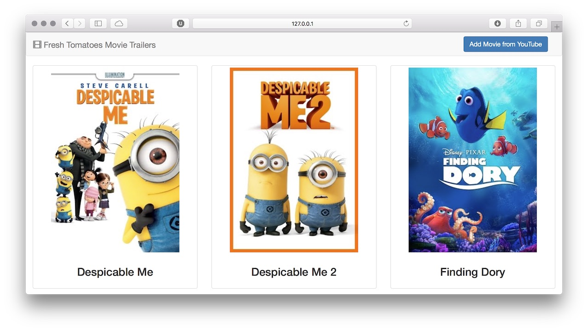
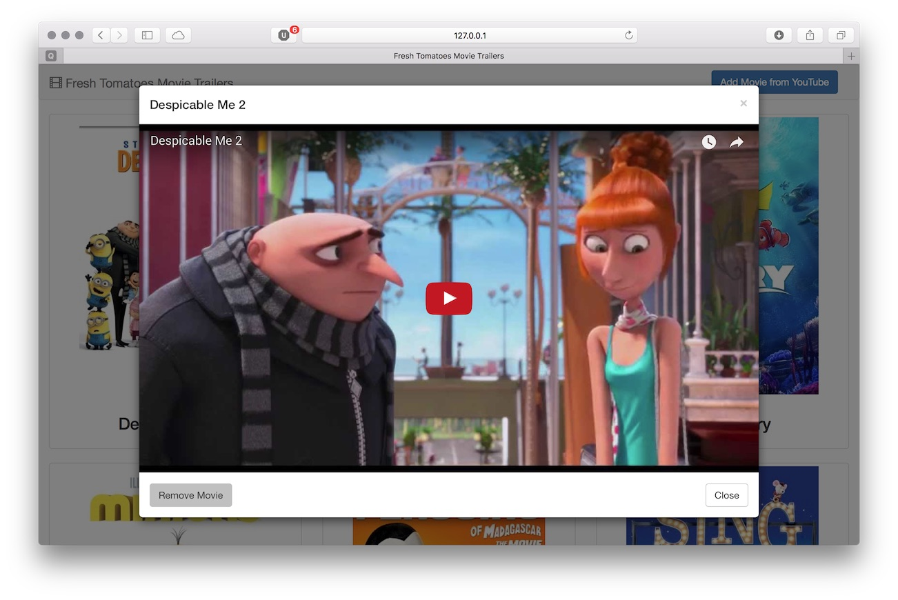
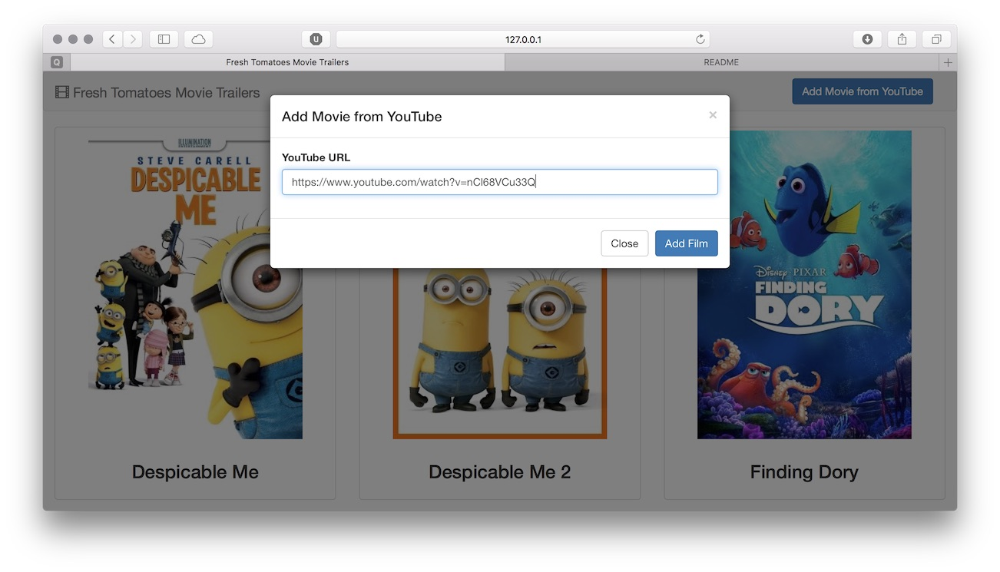

# Fresh Tomatoes

This repository is my submission for the Movie Trailer Website for the
[Full Stack Web Developer Nanodegree][nd004] program at [Udacity][udacity].
The web application is called "Fresh Tomatoes" and shows thumbnails of
select movies. Visitors can add movies from YouTube and remove movies they
don't like.

Fresh Tomatoes is implemented in Python using [Flask][flask],
[SQLAlchemy][sqlalchemy], and [Twitter Bootstrap][bootstrap].

## Prerequisites

Fresh Tomatoes can be installed as a Python module that will automatically
resolve dependencies. However, I recommend that you run Fresh Tomatoes using
[Anaconda][anaconda] to keep your system's Python installation clean. Anaconda
is a popular Python installer and package manager widely used in the Data
Science community. Follow the [link to install Anaconda][anaconda].

Once you have Anaconda installed, clone the code from [GitHub][github].

```sh
git clone https://github.com/jakelee8/fresh_tomatoes && cd fresh_tomatoes
```

If you are using Anaconda, run the `./bin/conda_env` script from the project
directory to set up the Python environment for Fresh Tomatoes.

```sh
./bin/conda_env
```

Regardless of whether you are using Anaconda, running the `./bin/dev` script
from the project directory will start the Flask application in development
mode. Note that Fresh Tomatoes will create a SQLite database at
`/tmp/fresh_tomatoes.sqlite`. If this is not acceptable, remember to change
the script accordingly before starting the app.

```sh
./bin/env
```

If the script runs without errors, Fresh Tomatoes will be accessible at

> http://127.0.0.1:5000



Running the `./bin/env` script will reset the database on each run.

## Usage

### Playing movie trailers

Click on any of the movie posters to play it.



### Adding a movie from YouTube

Click "Add Movie from YouTube" and paste the YouTube link to add it to Fresh
Tomatoes. For example, we can add "Up (2009)" the movie using this link:

> https://www.youtube.com/watch?v=nCl68VCu33Q



## Removing a movie

You can remove a movie by clicking "Remove Movie" in the lower-left corner
of the trailer player.


[udacity]: https://www.udacity.com
[nd004]: https://classroom.udacity.com/nanodegrees/nd004
[flask]: http://flask.pocoo.org
[sqlalchemy]: http://docs.sqlalchemy.org
[bootstrap]: http://getbootstrap.com
[anaconda]: https://www.continuum.io/anaconda-overview
[github]: https://github.com/jakelee8/fresh_tomatoes
